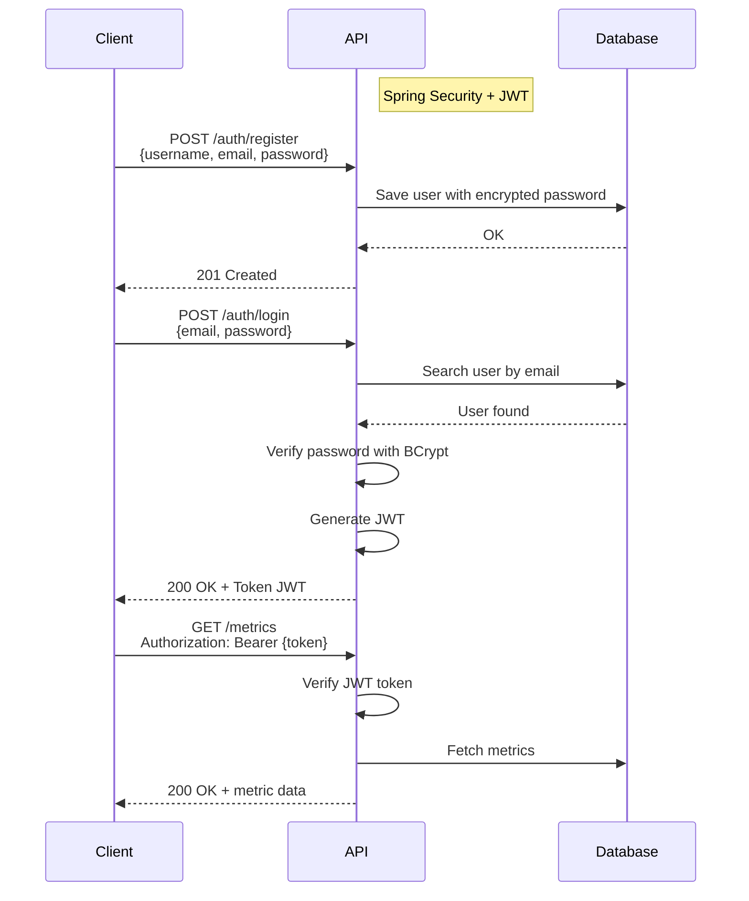

run `docker compose --profile app up --build`

 
🧩 Show Authorization Flow in Mermaid Diagram

```mermaid
sequenceDiagram
    participant C as Client
    participant A as API
    participant DB as Database
    Note right of A: Spring Security + JWT

    C->>A: POST /auth/register<br>{username, email, password}
    A->>DB: Save user with encrypted password
    DB-->>A: OK
    A-->>C: 201 Created

    C->>A: POST /auth/login<br>{email, password}
    A->>DB: Search user by email
    DB-->>A: User found
    A->>A: Verify password with BCrypt
    A->>A: Generate JWT
    A-->>C: 200 OK + Token JWT

    C->>A: GET /metrics<br>Authorization: Bearer {token}
    A->>A: Verify JWT token
    A->>DB: Fetch metrics
    A-->>C: 200 OK + metric data

```

